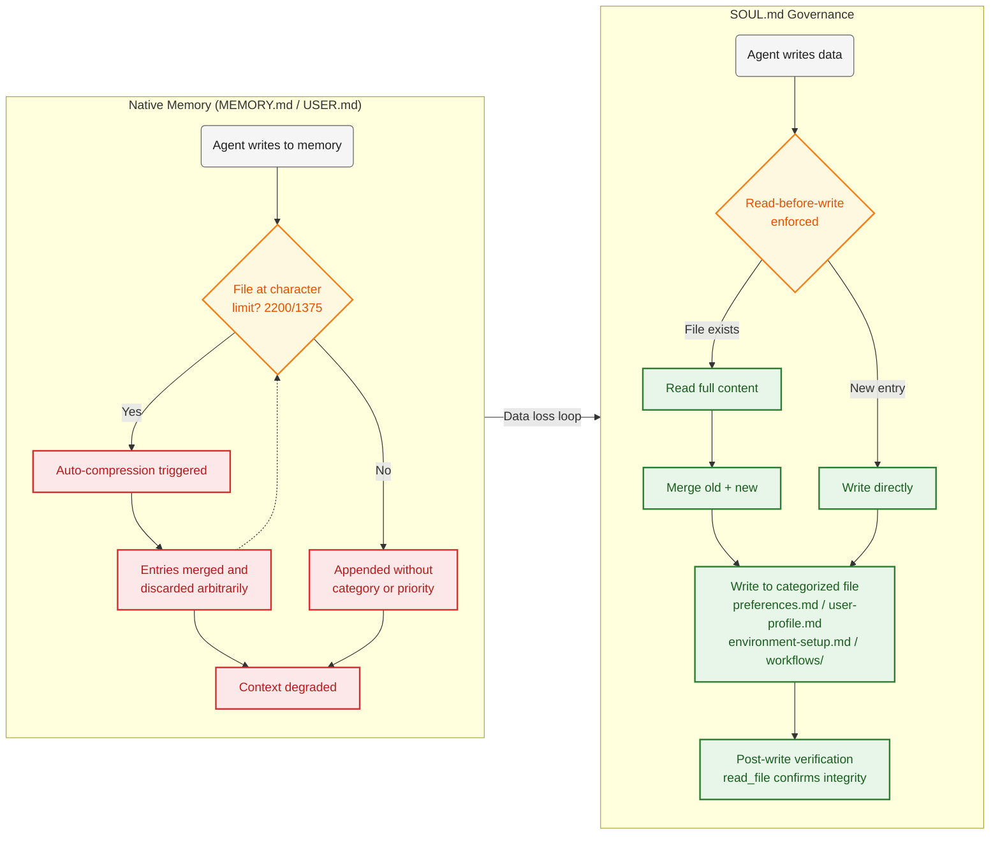

<p align="center">
  <br>
  <b>SOUL.md Governance Framework</b><br>
  <i>Replacing Hermes Agent's fragile memory compression cycle with an immutable governance layer.</i>
</p>

<p align="center">
  <a href="https://github.com/jangyuxue/hermes-soul-governance/blob/main/LICENSE"></a>
  <a href="#"></a>
  <a href="#"></a>
  <a href="https://github.com/jangyuxue/hermes-soul-governance/stargazers"></a>
</p>



> **Hermes Agent's native `MEMORY.md` has a 2200-character limit and auto-compression loop that silently discards context.**
> SOUL.md replaces it with a **read-only governance anchor** + **structured file persistence** — no compression, no data loss.

## 30-Second Quick Start

```bash
# 1. Deploy the framework template to your Hermes installation
cp -r framework/* ~/.hermes/

# 2. Configure your role and language
vim ~/.hermes/SOUL.md
#    → Section 1: Replace <YOUR_ROLE> and <YOUR_LANGUAGE>

# 3. Disable Hermes native memory system
hermes config set memory.memory_enabled false
hermes config set memory.user_profile_enabled false

# 4. Run maintenance script to sync skill registry
~/.hermes/hermes-agent/venv/bin/python \
  ~/.hermes/skills/user-created/skill-maintenance/scripts/maintain.py

# 5. Verify
~/.hermes/hermes-agent/venv/bin/python \
  ~/.hermes/skills/user-created/skill-maintenance/scripts/maintain.py
# Expected: "No changes" — everything is in sync
```

[Full deployment guide →](#quick-start)

---

## Prerequisites

This framework is designed for **Hermes Agent**. You must have Hermes Agent installed and working before using this framework.

Files referenced throughout the framework assume the default Hermes installation path:

```
~/.hermes/
├── hermes-agent/           ← Source code
│   └── venv/bin/python     ← Python interpreter used by scripts
├── config.yaml             ← Configuration
└── SOUL.md                 ← This framework (adds this file)
```

If your installation uses a different path, adjust the Python interpreter path in scripts accordingly.

---

## Background

### 1.1 Memory System Defects

Hermes Agent stores persistent memory in two files: `MEMORY.md` (2200-character limit) and `USER.md` (1375-character limit). When either file reaches capacity, the system triggers an automatic compression cycle — merging existing entries, discarding context, and rewriting the file to free space. This process repeats each time the file fills again.

Over multiple cycles, the following issues manifest:

- **No category separation** — preferences, environment configuration, workflow notes, and system auto-summaries occupy the same file without structural partitioning.
- **No priority retention** — compression treats all entries equally. Recent and outdated information are merged or discarded without differentiation.
- **No write-time rule enforcement** — the agent writes via tool calls that do not read file contents beforehand. Rules defined inside `MEMORY.md` or `USER.md` are only evaluated when the file is full and compression is required, which is not a reliable enforcement point.
- **Context degradation** — the compressed output, when injected into the system prompt across sessions, reduces response coherence and increases debugging overhead.

These issues are architectural: the files are both writable and auto-injected. Any rules placed inside them can be overwritten or ignored at write time.

### 1.2 Skill System Limitations

Hermes Agent's built-in system prompt includes the following instruction:

> *"After completing a complex task (5+ tool calls), fixing a tricky error, or discovering a non-trivial workflow, save the approach as a skill with skill_manage."*

This mechanism opens a creation path but provides no corresponding maintenance infrastructure:

- **No expiry or deprecation** — once created, skills persist on disk indefinitely.
- **No quality validation** — malformed or empty skills are accepted without checks.
- **No duplicate detection** — newly created skills are not compared against existing ones for overlap.
- **No auto-registration** — created skills are not added to `user_capabilities.json`. The trigger matching system (`capability_finder.py`) cannot discover them.

The result is a unidirectional pipeline: creation without maintenance. Skills accumulate, quality degrades, and the registry becomes increasingly out of sync with what is on disk.

### 1.3 Scope of This Framework

This framework addresses the two problems described above. It provides infrastructure for:

- Disabling the default memory system and replacing it with file-based, categorized persistence
- Automating skill registration, validation, and cleanup
- Maintaining a trigger-based skill retrieval system

---

## SOUL.md — The Core File

### What Makes SOUL.md Different

`~/.hermes/SOUL.md` is the central file of this framework. It has two properties that distinguish it from `MEMORY.md` and `USER.md`:

| Property | `MEMORY.md` / `USER.md` | `SOUL.md` |
|----------|------------------------|-----------|
| Injection | Auto-injected (configurable) | Auto-injected (no toggle) |
| Write path | Agent can write via `memory()` | **No write function exists** |
| Character limit | 2200 / 1375 | Unlimited |
| Priority in prompt | After system prompt | **First** (`prompt_parts[0]`) |

Because SOUL.md has **no write function** in the codebase, the agent cannot modify it through any tool call. This makes it a read-only anchor: rules defined here persist across sessions and cannot be overwritten by memory operations.

The native memory system (`MEMORY.md` / `USER.md`) is disabled via configuration:

```yaml
# config.yaml
memory:
  memory_enabled: false
  user_profile_enabled: false
```

### Section-by-Section Guide

#### Section 1: Identity & Role

Defines the agent's persona. **You must edit this section** after deploying:

```markdown
1.1 Role: <YOUR_ROLE>
# Example: "Backend Engineer", "Data Scientist", "Senior Developer"

1.2 Language: <YOUR_LANGUAGE>
# Example: "English", "Chinese (中文)"
```

#### Section 2: Response Standards

Quality constraints on agent output:
- Must end with a genuine question (no "is that correct?")
- Must cite evidence (check files before answering)
- Mode switching: exploration (brainstorm) vs execution (precise commands)

Chinese example keywords are included because this framework was originally developed for a Chinese-speaking user. Replace with your language as needed.

#### Section 3: Persistence — Write Protocol

**This is the core of the memory system.** It defines:

- **3.1**: When to write (user says "remember", states a preference, corrects a fact)
- **3.2**: How to write (`write_file` only, never `memory()`)
- **3.3-3.4**: Read-before-write enforcement (prevents data corruption)
- **3.5**: Trigger keyword matching (maps user input to specific files)
- **3.5.1**: The keyword-to-file mapping table:

```
"I like...", "I prefer..."         → user-memory/preferences.md
"I am...", "My name is..."         → user-memory/user-profile.md
"My system is...", "I use..."      → user-memory/environment-setup.md
"My steps for..."                  → user-memory/workflows/<name>.md
"Add a skill", "Register"          → user-registry/user_capabilities.json
```

This replaces the default memory system with structured, categorized files.

#### Section 4: Retrieval Protocol

Defines how the agent reads your stored information:
- Search-first: keyword match via `search_files`, only read matching paragraphs
- On-demand: never load all `user-memory/` files at once
- Freshness rule: always read from file, never from session context memory

#### Section 5: Operational Constraints

Rules for file operations:
- **5.1**: Backup before modification (to `user-memory/.backup/`)
- **5.3**: Protected directories (no deletion under `skills/`, `output/`, `memories/`)
- **5.4**: Output goes to `~/.hermes/output/{images|documents|data|temp}/`
- **5.5**: **Important** — All Python operations must use `~/.hermes/hermes-agent/venv/bin/python`, not system `python3`. This venv contains the required dependencies (httpx, openai, etc.). System Python is externally managed on some distributions and will fail.

#### Section 6: Skill Dispatch

How the agent routes user requests to registered skills:

```
User input → capability_finder.py → user_capabilities.json
  → Match found → execute skill script
  → No match → agent responds directly
```

`capability_finder.py` lives at `~/.hermes/user-registry/capability_finder.py`. It scores triggers: exact match (100), trigger in query (50), query in trigger (10).

#### Section 7: Skill Creation & Storage

Defines where skills live and how they're maintained:

| Type | Location | Created by | Maintained by |
|------|----------|------------|--------------|
| Auto-generated | `auto-generated/` | Agent (after complex tasks) | `maintain.py` + agent |
| User-created | `user-created/` | User | `maintain.py` (registry only) |

The maintenance script (`maintain.py`) at `~/.hermes/skills/user-created/skill-maintenance/scripts/maintain.py`:
- Scans both directories
- Auto-registers new skills in `user_capabilities.json`
- Auto-unregisters deleted skills
- Fixes malformed `SKILL.md` (adds frontmatter, name, description)
- Validates triggers (empty triggers = unreachable skill)

#### Section 8: Compliance & Audit

Enforcement rules:
- Every write must be verified (post-write `read_file`)
- Failed writes must be reported and restored from backup
- Any deviation from these rules must be reported immediately

---

## Quick Start

```bash
# 0. Prerequisite: Hermes Agent must be installed
#    If not, install first: curl -fsSL https://raw.githubusercontent.com/... | bash

# 1. Deploy framework template
cp -r framework/* ~/.hermes/

#    This adds SOUL.md, user-memory/, user-registry/, skills/, output/
#    to your ~/.hermes/ directory, replacing the default SOUL.md.
#    Your existing ~/.hermes/SOUL.md will be overwritten.
#    Backup first if you customized it.

# 2. Edit SOUL.md — replace placeholders in Section 1
vim ~/.hermes/SOUL.md
#    1.1 Role: <YOUR_ROLE>       → "Backend Engineer"
#    1.2 Language: <YOUR_LANGUAGE> → "English"

# 3. Disable Hermes default memory
#    The native MEMORY.md and USER.md files are no longer used.
#    They can be left in place (harmless) or deleted.
hermes config set memory.memory_enabled false
hermes config set memory.user_profile_enabled false
#
#    If the hermes CLI is unavailable, edit config.yaml directly:
#
#    vim ~/.hermes/config.yaml
#
#    Find or add the memory section:
#
#    memory:
#      memory_enabled: false
#      user_profile_enabled: false
#
#    Save the file and restart Hermes for changes to take effect.

# 4. Run maintenance script to register existing skills
~/.hermes/hermes-agent/venv/bin/python \
  ~/.hermes/skills/user-created/skill-maintenance/scripts/maintain.py

# 5. Verify everything works
~/.hermes/hermes-agent/venv/bin/python \
  ~/.hermes/skills/user-created/skill-maintenance/scripts/maintain.py
# Expected output: "No changes" (indicates everything is in sync)
```

---

## Repository Contents

```
hermes-soul-governance/
├── README.md                    # This file
├── README_CN.md                 # Chinese version
├── SOUL.md                      # Governance rules (core of the framework)
├── .gitignore
├── framework/                   # Deployable template — copy to ~/.hermes/
│   ├── README.md                # Quick reference for each directory
│   ├── SOUL.md                  # Same as root SOUL.md (with placeholders)
│   ├── user-memory/
│   │   ├── README.md            # File descriptions and triggers
│   │   ├── preferences.md       # Communication style, habits
│   │   ├── user-profile.md      # Identity, role
│   │   ├── environment-setup.md # Toolchain, paths
│   │   ├── .backup/             # Auto-backup before writes
│   │   └── workflows/
│   │       └── workflow-commands.json  # Machine-readable steps
│   ├── user-registry/
│   │   ├── README.md            # Component descriptions
│   │   ├── user_capabilities.json
│   │   └── capability_finder.py
│   ├── skills/
│   │   ├── auto-generated/
│   │   │   ├── README.md
│   │   │   └── self_created_skills.json
│   │   └── user-created/
│   │       └── skill-maintenance/
│   │           ├── scripts/maintain.py
│   │           ├── test_maintain.py
│   │           └── SKILL.md
│   └── output/                  # Agent output directory
│       ├── README.md
│       ├── images/
│       ├── documents/
│       ├── data/
│       └── temp/
├── examples/
│   ├── auto-generated/self_created_skills.json
│   └── user_capabilities.json
└── framework/skills/user-created/skill-maintenance/
    ├── scripts/maintain.py
    ├── test_maintain.py
    └── SKILL.md
```

---

## Testing

```bash
python3 framework/skills/user-created/skill-maintenance/test_maintain.py
```

11 test cases: empty directory, new skill detection, SKILL.md auto-fix, registry sync, deletion unregister, idempotency, manifest consistency, mixed skill types, validation warnings, clean state. All passing.

---

## Known Limitations

1. **Rule enforcement** — SOUL.md ensures rules are present in the system prompt, but compliance depends on model instruction-following capability. This is inherent to LLM-based systems.

2. **Skill classification** — The maintenance script uses heuristic criteria (session reference files, reference count, file size) to classify auto-generated skills. These heuristics match current generation patterns but may require adjustment.

---

## License

MIT
