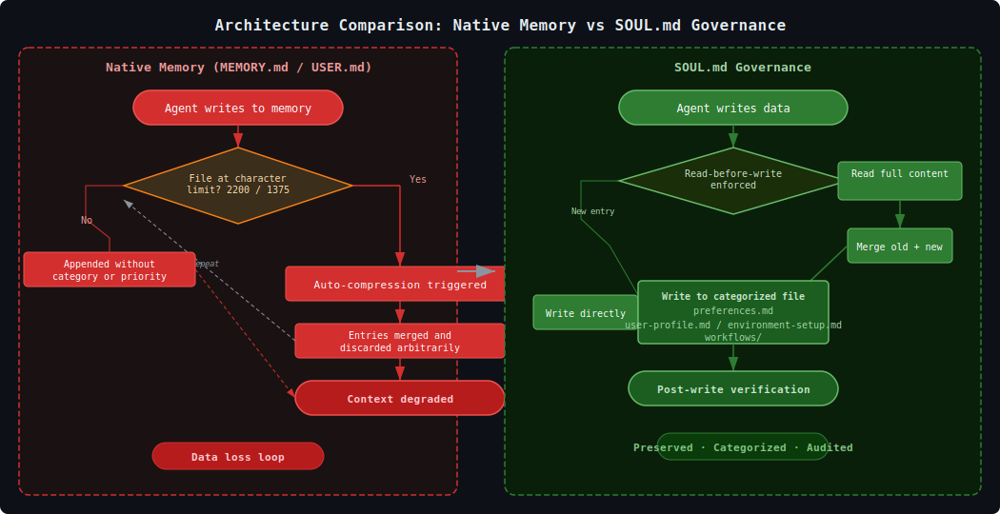

<p align="center">
  <br>
  <b>SOUL.md 治理框架</b><br>
  <i>用不可变治理层替代 Hermes Agent 脆弱的记忆压缩循环。</i>
</p>

<p align="center">
  <a href="https://github.com/jangyuxue/hermes-soul-governance/blob/main/LICENSE"></a>
  <a href="#"></a>
  <a href="#"></a>
  <a href="https://github.com/jangyuxue/hermes-soul-governance/stargazers"></a>
</p>

<p align="center">
  
</p>

> **Hermes Agent 原生的 `MEMORY.md` 仅有 2200 字符上限，自动压缩循环会静默丢弃上下文。**
> SOUL.md 用**只读治理锚点** + **结构化文件持久化**替代它——无压缩，无数据丢失。

## 30 秒快速上手

```bash
# 0. 首先获取框架文件
git clone https://github.com/jangyuxue/hermes-soul-governance.git
cd hermes-soul-governance

# 1. 部署核心组件到 ~/.hermes/
cp framework/SOUL.md ~/.hermes/SOUL.md
cp -r framework/user-memory ~/.hermes/
cp -r framework/user-registry ~/.hermes/
cp -r framework/skills/user-created ~/.hermes/skills/

# 2. 配置你的角色和语言
vim ~/.hermes/SOUL.md
#    → 第 1 节：替换 <YOUR_ROLE> 和 <YOUR_LANGUAGE>

# 3. 关闭 Hermes 原生记忆系统
hermes config set memory.memory_enabled false
hermes config set memory.user_profile_enabled false

# 4. 运行维护脚本，同步技能注册表
~/.hermes/hermes-agent/venv/bin/python \
  ~/.hermes/skills/user-created/skill-maintenance/scripts/maintain.py
```

⚠️ **部署前请阅读各目录中的 README 了解其用途：**
- `~/.hermes/user-memory/` → 结构化记忆文件（偏好、档案等）
- `~/.hermes/user-registry/` → 技能发现系统
- `~/.hermes/skills/` → 技能脚本与维护（不会覆盖已有的 auto-generated）
- `~/.hermes/output/` → agent 文件输出目录

---

## 前置条件

本框架专为 **Hermes Agent** 设计。使用前必须已安装并正常运行 Hermes Agent。

框架中引用的路径均基于默认安装路径：

```
~/.hermes/
├── hermes-agent/           ← 源码
│   └── venv/bin/python     ← Python 解释器（脚本使用）
├── config.yaml             ← 配置文件
└── SOUL.md                 ← 本框架（新增此文件）
```

如果安装路径不同，请相应调整脚本中的 Python 解释器路径。

---

## 背景

### 1.1 记忆系统缺陷

Hermes Agent 将持久性记忆存储在 `MEMORY.md`（2200 字符上限）和 `USER.md`（1375 字符上限）两个文件中。写入超出容量时，系统自动触发压缩流程——合并已有条目、丢弃上下文、重写文件以腾出空间。每次写满后重复此流程。

经过多次循环后，出现以下问题：

- **缺乏分类隔离** — 偏好、环境配置、工作流记录、系统自动总结混合在同一个文件中。
- **缺乏优先级保留** — 压缩对所有条目一视同仁，近期信息与过期信息被同等处理。
- **写入时无法执行规则** — agent 通过工具函数写入，不会先读取文件内容。规则仅在文件写满需要压缩时才被读取。
- **上下文退化** — 压缩后的内容在各轮对话间持续注入，降低回复一致性。

这些问题的根源在架构层面：两个文件既可写入又会自动注入。定义其中的规则可能在写入时被覆盖或忽略。

### 1.2 技能系统缺陷

Hermes Agent 的系统提示词中有一句指令：

> *"完成复杂任务（5+ 次工具调用）、修复棘手错误或发现非平凡工作流后，使用 skill_manage 将方法保存为技能。"*

此机制只开了创建的口子，没有配套的维护工具：

- **无过期机制** — 技能创建后永久存在于磁盘。
- **无质量校验** — 格式异常或内容为空的技能同样通过。
- **无重复检测** — 新技能不与已有技能进行比较。
- **无自动注册** — 创建的技能不会自动加入 `user_capabilities.json`。

结果是单向管道：只有创建，没有维护。

### 1.3 本框架的范围

本框架针对上述两个问题提供解决方案。

---

## SOUL.md — 核心文件

### SOUL.md 的独特之处

`~/.hermes/SOUL.md` 是本框架的核心文件。它有两个区别于 `MEMORY.md` 和 `USER.md` 的特性：

| 特性 | `MEMORY.md` / `USER.md` | `SOUL.md` |
|------|------------------------|-----------|
| 注入方式 | 自动注入（可配置） | 自动注入（不可关闭） |
| 写入入口 | agent 可通过 `memory()` 写入 | **不存在写函数** |
| 容量限制 | 2200 / 1375 字符 | 不限制 |
| 提示词优先级 | 在系统提示词之后 | **首位**（`prompt_parts[0]`） |

因为代码库中没有 SOUL.md 的写入函数，agent 无法通过任何工具调用修改它。这使其成为一个只读锚点：规则跨会话持续有效，不会被记忆操作覆盖。

原生命令系统通过配置关闭：

```yaml
# config.yaml
memory:
  memory_enabled: false
  user_profile_enabled: false
```

### 各章节详解

#### 第 1 节：身份与角色

定义 agent 的人设。**部署后必须编辑这一节**：

```markdown
1.1 Role: <YOUR_ROLE> — thinking partner (fact-based, detailed, no hollow confirms).
  NOT a search engine or command executor.
  # 示例："后端工程师", "数据分析师", "产品经理"

1.2 Language: ALWAYS respond in <YOUR_LANGUAGE>. Applies to ALL responses: explanations, code comments, questions.
  Exception: user explicitly writes in another language.
  # 示例："中文", "English", "Japanese"
```

#### 第 2 节：响应标准

对 agent 输出的质量约束：
- 必须以真问题结尾（不要"对吗？""明白了吗？"）
- 必须引用证据（回答前先查文件）
- 模式切换：探索模式（头脑风暴）vs 执行模式（精确执行）

#### 第 3 节：持久化写入协议

**这是记忆系统的核心。**定义了：

- **3.1**：何时写入（用户说"记住"、陈述偏好、纠正事实）
- **3.2**：如何写入（只能用 `write_file`，禁用 `memory()`）
- **3.3-3.4**：写前先读（防止数据损坏）
- **3.5**：触发关键词匹配（将用户输入映射到具体文件）
- **3.5.1**：关键词到文件的映射表：

```
"我喜欢...", "我习惯..."         → user-memory/preferences.md
"我是...", "我叫..."             → user-memory/user-profile.md
"我系统是...", "我用了..."        → user-memory/environment-setup.md
"我做XX的步骤..."                 → user-memory/workflows/<name>.md
```

这替代了默认记忆系统，使用结构化、分类化的文件存储。

#### 第 4 节：检索协议

定义 agent 如何读取你的存储信息：
- 优先搜索：通过 `search_files` 关键词匹配，只读匹配段落
- 按需加载：不一次性加载全部 `user-memory/` 文件
- 新鲜度规则：始终从文件读取，不依赖会话上下文

#### 第 5 节：操作约束

文件操作规则：
- **5.1**：修改前备份（到 `user-memory/.backup/`）
- **5.3**：受保护目录（禁止删除 `skills/`、`output/`、`memories/`、`skills/*/.history/` 下的文件）
- **5.4**：输出路径 `~/.hermes/output/{images|documents|data|temp}/`
- **5.5**：**重要** — 所有 Python 操作必须使用 `~/.hermes/hermes-agent/venv/bin/python`，不能使用系统 `python3`。此 venv 包含所需的依赖包。部分发行版的系统 Python 是外部管理的，直接使用会失败。

#### 第 6 节：技能分发

如何将用户请求路由到已注册的技能：

```
用户输入 → capability_finder.py → user_capabilities.json
  → 匹配成功 → 执行技能脚本
  → 无匹配 → agent 直接回复
```

`capability_finder.py` 位于 `~/.hermes/user-registry/capability_finder.py`。评分算法：精确匹配（100）、包含匹配（50）、被包含匹配（10）。

#### 第 7 节：技能创建与存储

定义技能存放位置和维护方式：

| 类型 | 位置 | 创建者 | 维护者 |
|------|------|--------|--------|
| 自动生成 | `auto-generated/` | Agent（复杂任务后） | `maintain.py` + agent |
| 用户创建 | `user-created/` | 用户 | `maintain.py`（仅注册表） |

维护脚本（`maintain.py`）位于 `~/.hermes/skills/user-created/skill-maintenance/scripts/maintain.py`，按顺序执行五个阶段：

| 阶段 | 功能 |
|------|------|
| [Orphan] | 扫描分类目录下的子技能 AND 直接放在 `skills/<name>/` 的独立技能（如 agent 直接创建的），将非 bundled 技能迁移到 `auto-generated/`，写入注册表并添加 lifecycle 字段 |
| [Sync] | 对比 `auto-generated/` 磁盘与注册表 lifecycle 字段：检测新增/删除/恢复的技能，自动将 SKILL.md 的 `description` 变更同步到注册表 |
| [Reg] | 检查 `user-created/` 注册表一致性——添加缺失条目，移除已删除的。不修改技能内容 |
| [Check] | 校验注册表条目（空触发词、路径失效）、自动修复异常的 SKILL.md（仅 auto-generated）、通过 5 轴评分（名称、内容关键词、章节结构、交叉引用、文件结构）检测合并候选，配有三层防误报门控 |
| [Snapshot] | 将 `user_capabilities.json` 保存一份带时间戳的副本到 `.history/`，用于变更审计和回滚参考 |

---

## 快速开始

```bash
# ============================================
# 第 0 步：获取框架
# ============================================
# 将仓库下载到你的电脑
git clone https://github.com/jangyuxue/hermes-soul-governance.git

# 进入项目目录
cd hermes-soul-governance

# ============================================
# 第 1 步：部署到 ~/.hermes/
# ============================================
# 前置条件：Hermes Agent 必须已安装在 ~/.hermes/

# 1a. 部署 SOUL.md（治理锚点 - 替换默认的 SOUL.md）
cp framework/SOUL.md ~/.hermes/SOUL.md

# 1b. 部署 user-memory/（分类记忆文件）
#     创建：preferences.md, user-profile.md, environment-setup.md, workflows/
#     阅读：cat ~/.hermes/user-memory/README.md
cp -r framework/user-memory ~/.hermes/

# 1c. 部署 user-registry/（技能发现系统）
#     创建：capability_finder.py, user_capabilities.json
#     阅读：cat ~/.hermes/user-registry/README.md
cp -r framework/user-registry ~/.hermes/

# 1d. 合并 skills/ - 只部署 user-created/ 部分
#     重要：不会覆盖 auto-generated/，你已有的技能不受影响
#     阅读：cat ~/.hermes/skills/user-created/skill-maintenance/README.md
cp -r framework/skills/user-created ~/.hermes/skills/

# 1e. 创建 output/ 目录（agent 文件输出位置）
mkdir -p ~/.hermes/output/{images,documents,data,temp}

# ============================================
# 第 2 步：部署后配置
# ============================================

# 2a. 编辑 SOUL.md — 替换第 1 节的占位符
vim ~/.hermes/SOUL.md
#    1.1 Role: <YOUR_ROLE>       → "后端工程师"
#    1.2 Language: <YOUR_LANGUAGE> → "中文"

# 2b. 关闭 Hermes 默认记忆系统
#     MEMORY.md 和 USER.md 保留在磁盘上（不影响），但不再使用
hermes config set memory.memory_enabled false
hermes config set memory.user_profile_enabled false
#
#     如果 hermes CLI 不可用，直接编辑 config.yaml：
#     vim ~/.hermes/config.yaml
#     添加：
#       memory:
#         memory_enabled: false
#         user_profile_enabled: false

# 2c. 运行维护脚本，注册所有技能
~/.hermes/hermes-agent/venv/bin/python \
  ~/.hermes/skills/user-created/skill-maintenance/scripts/maintain.py

# 2d. 验证一切同步
~/.hermes/hermes-agent/venv/bin/python \
  ~/.hermes/skills/user-created/skill-maintenance/scripts/maintain.py
# 预期输出："No changes" — 所有技能已注册并同步
```

---

## 仓库内容

```
hermes-soul-governance/
├── README.md                    # 本文档（英文版）
├── README_CN.md                 # 中文版
├── CONTRIBUTING.md              # 贡献指南
├── .gitignore
├── docs/
│   └── assets/
│       ├── architecture.svg     # 架构对比图
│       └── render.html          # 交互式架构渲染
└── framework/                   # 可部署模板 — 所有部署内容
    ├── README.md                # 部署说明
    ├── SOUL.md                  # 治理规则（框架核心）
    ├── RELEASE_NOTE_v1.0.0.md   # v1.0.0 发行说明
    ├── RELEASE_NOTE_v1.1.0.md   # v1.1.0 发行说明
    ├── RELEASE_NOTE_v2.0.0.md   # v2.0.0 发行说明
    ├── RELEASE_NOTE_v3.0.0.md   # v3.0.0 发行说明
    ├── user-memory/             # 分类记忆存储
    │   ├── README.md
    │   ├── preferences.md
    │   ├── user-profile.md
    │   ├── environment-setup.md
    │   ├── .backup/
    │   └── workflows/
    │       ├── README.md
    │       └── workflow-commands.json
    ├── user-registry/           # 能力发现系统
    │   ├── README.md
    │   ├── user_capabilities.json
    │   └── capability_finder.py
    ├── skills/                  # 技能管理
    │   ├── auto-generated/
    │   │   └── README.md
    │   └── user-created/
    │       ├── README.md
    │       └── skill-maintenance/
    │           ├── README.md
    │           ├── SKILL.md
    │           ├── scripts/
    │           │   ├── maintain.py    # 自动注册/校验/清理技能
    │           │   └── test_maintain.py  # 9 个测试用例（本地文件）
    │           └── .history/          # 注册表快照（自动创建）
    ├── output/                  # 输出目录
    │   ├── README.md
    │   ├── images/
    │   ├── documents/
    │   ├── data/
    │   └── temp/
    └── examples/
        └── user_capabilities.json    # 示例含 lifecycle 字段
```

---

## 已知限制

1. **规则执行** — SOUL.md 能确保规则加载到系统提示词中，但模型是否遵守取决于其指令遵循能力。这是基于 LLM 的系统的固有属性。

2. **合并检测为启发式** — 5 轴评分能识别内容重叠，但不理解语义。可能存在误报，合并前务必人工审核。三层门控（零内容跳过、Jaccard < 0.15 跳过、< 2 轴跳过）能排除大部分偶然匹配，但无法保证零错误。

3. **技能分类** — 维护脚本使用启发式标准（session 引用文件、引用数量、文件大小）判断技能类型。当前规则与现有模式匹配，但 agent 行为变化时可能需要调整。

---

## 开源许可证

MIT
